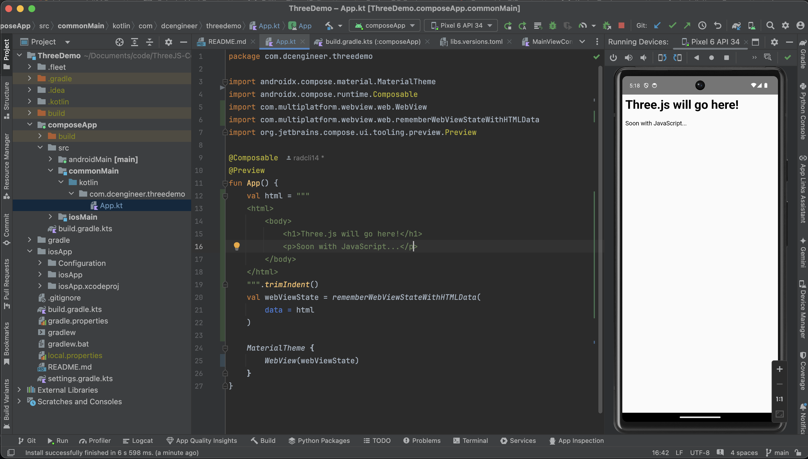
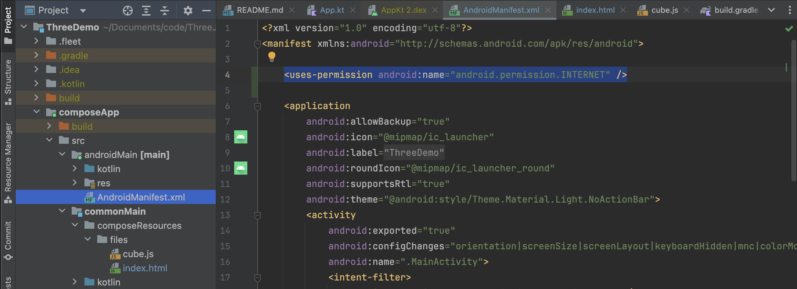
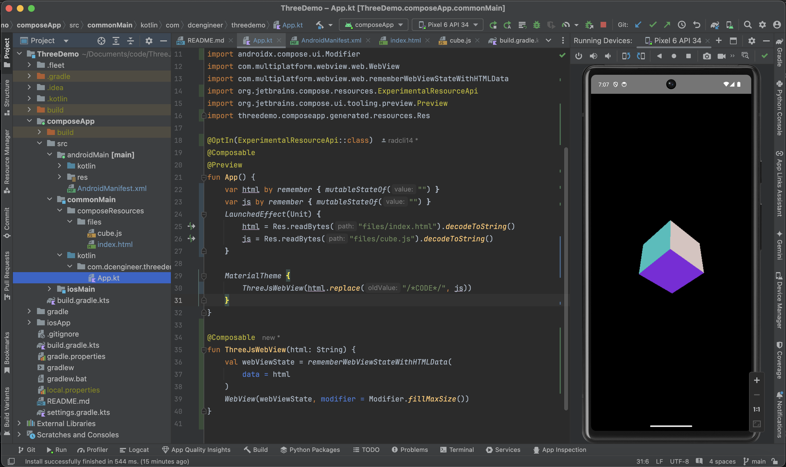
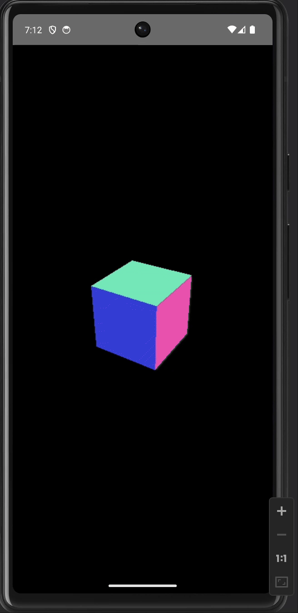
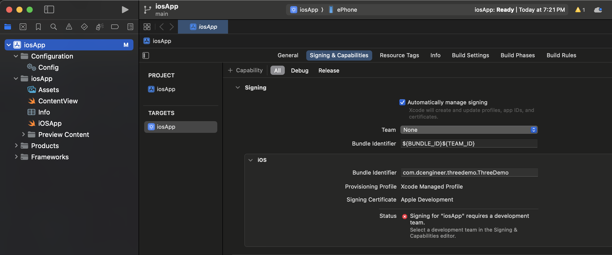
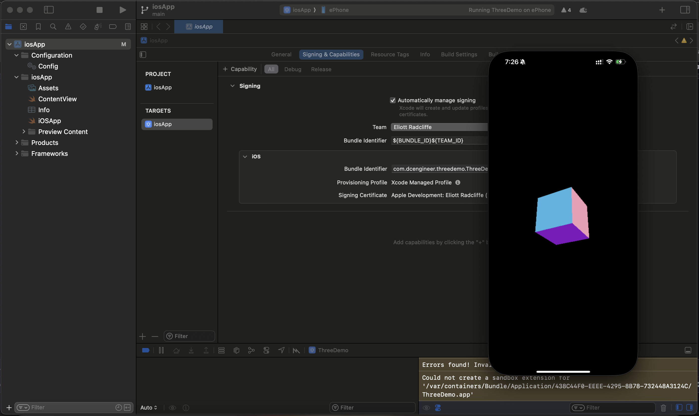
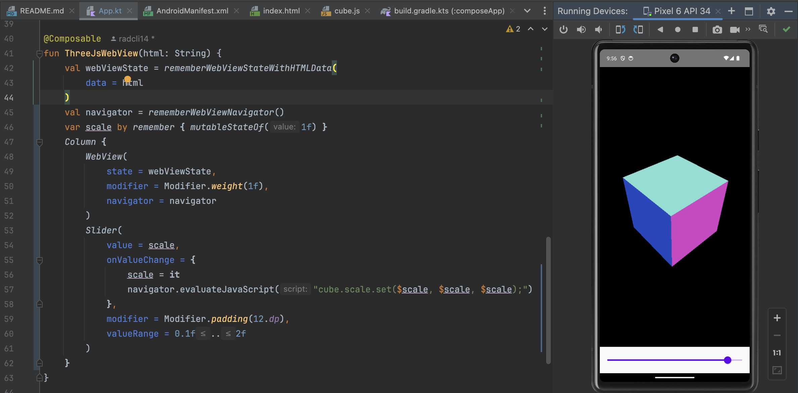
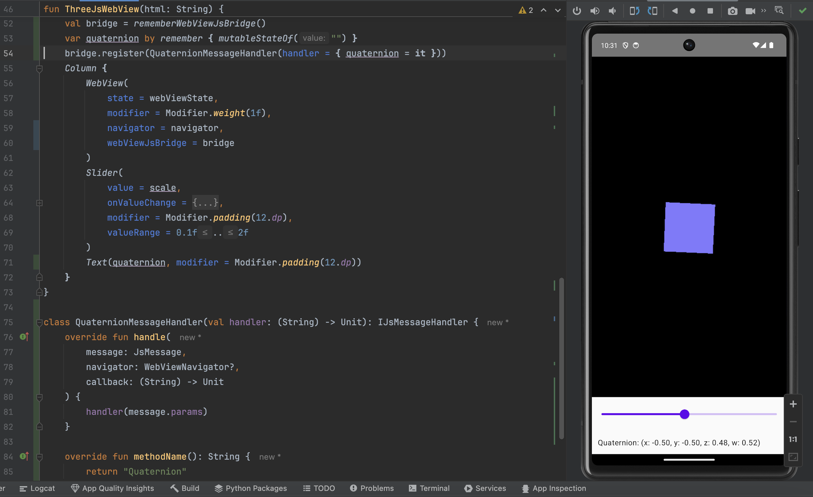

# ThreeJS-ComposeMultiplatform
Integration of the Three.js toolset into the Compose Multiplatform framework 

## Procedure
The sections below provide a step-by-step process describing how a lightweight, Three.js environment may be embedded in an Android/iOS multiplatform app using Jetpack Compose Multiplatform.
The tutorial is detailed, however, you may also choose to simply clone or fork this repository to start your own project.
Alternately, you can build your project starting from the [Kotlin Multiplatform wizard](https://kmp.jetbrains.com/?), and get Three.js running as follows:
- Include a dependency in your `build.gradle.kts` file for [Compose Webview Multiplatform](https://kevinnzou.github.io/compose-webview-multiplatform/).
- Add an [HTML header file](https://github.com/radcli14/ThreeJS-ComposeMultiplatform/blob/main/ThreeDemo/composeApp/src/commonMain/composeResources/files/index.html) with an import map for Three.js version 0.173.0, and preferred styling for mobile, into `composeResources/files`.
- Add a [sample JavaScript file](https://github.com/radcli14/ThreeJS-ComposeMultiplatform/blob/main/ThreeDemo/composeApp/src/commonMain/composeResources/files/index.html), which renders a simple rotating cube, into `composeResources/files`.
- Replace code in the common `App.kt` code file with [code that generates a WebView](https://github.com/radcli14/ThreeJS-ComposeMultiplatform/blob/main/ThreeDemo/composeApp/src/commonMain/kotlin/com/dcengineer/threedemo/App.kt) referencing the HTML and Javascript resources.

I mostly bypass some of the basics of Android and Jetpack Compose, but have provided links where appropriate.
The one thing I do suggest is to **use the Kotlin Multiplatform Wizard** that I have [linked](https://kmp.jetbrains.com/?).
While you can create the project directly within Android Studio while bypassing that link, generally the wizard is agreed to be more up-to-date at any given time, and its project structure should be consistent with the tutorrial.

### Coding Environment Setup
- Install the latest Android Studio. [Link](https://developer.android.com/studio)
  * Optional: install XCode if building for iOS. 
- Configure Android Studio for Compose Multiplatform. [Link](https://www.jetbrains.com/help/kotlin-multiplatform-dev/compose-multiplatform-create-first-app.html)
  * Install the Kotlin Multiplatform plugin.
  * Run Kdoctor to verify.
- Optional: Create a GitHub project.
  * Give it a name.
  * Select public or private.
  * Optional: create README and license files.


 
### Compose Multiplatform Template
- Visit the Kotlin Multiplatform wizard site. [Link](https://kmp.jetbrains.com/?)
  * Provide a name, does not have to match your Github repository, I chose `ThreeDemo`.
  * Provide a unique project ID, I use `com.dcengineer.threedemo`.
    - These will generally use reverse domain syntax, and if you publish your app, will be used by the Google Play or App Store to identify it.
    - You should choose carefully as this may become semi-permanent.
  * Select which OS's you want to support.
    - For demonstration, I only selected Android and iOS.
    - For iOS, I selected to share UI, which is the purpose of Compose Multiplatform.
    - It is possible to migrate back to SwiftUI at a later date, Compose is likely a good choice for early prototyping.
    - Desktop, web, and server options are available, but will have varying degrees of support.
- Click the Download button
- Unzip, and move into your project folder.
- Optional, if you are using git, add, commit, and push your project to the remote.
```bash
git add ThreeDemo
git commit -am "added the compose multiplatform template files"
git push
```


### Open the Project in Android Studio
- Start Android Studio
- Click `File -> Open`
- Open the folder you just copied over.
   * In my case, I am selecting the `ThreeDemo` folder.
   * You do not need to select the root directory of the GitHub folder, just the folder created by the wizard.


- Usually, select to open the project in a new window


- "Trust" the project (its yours, after all)


- Android Studio will open starting from the `README.md` file


 
- After various gradle build and sync tasks complete, you may "Run" the project
   * You may need to set up an emulator, which is out of scope of this tutorial, but you may search online or use this [Link](https://developer.android.com/studio/run/emulator).
   * Or, you can run on your own device if you have one. [Link](https://developer.android.com/studio/run/device)
- The template app is just a simple button, which will display a Compose Multiplatform logo and platform-specific greeting when tapped.


### Optional: Remove Unnecessary Code and Resources

- In the upper left of the window, there is a dropdown; if it shows the word "Android," click on it and instead select "Project," which is my preferred view for multiplatform dependencies.
- Highlight the following files, and delete them (right click and refactor, press delete key, or other):
  * `composeApp/src/androidMain/kotlin/<yourAppID>/Platform.android.kt` : a script to get the string name of the Android platform, `Android 34` in the animation above.
  * `composeApp/src/commonMain/composeResources/drawable/compose-multiplatform.xml` : a Compose Multiplatform logo, the image in the center of the animation above.
  * `composeApp/src/commonMain/<yourAppID>/Greeting.kt` : a script that generates the greeting text, `Compose: Hello, Android 34` in the animation above.
  * `composeApp/src/commonMain/<yourAppID>/Platform.kt` : the "expect" function, that directs to the respective `Platform.android.kt` or `Platform.ios.kt` files depending on what device you are using.
  * `composeApp/src/iosMain/kotlin/<yourAppID>/Platform.ios.kt` : a script to get the string name of the iOS platform.


- If you get a warning that the `Greeting.kt` file has one usage, delete it anyway, as we will remove that usage in the following step.


- Navigate to `compose/src/commonMain/<yourAppID>/App.kt`; notice that the `Greeting().greet()` item is highlighted red, indicating that it will not build due to the deleted dependency.


- Delete all of the code Between `MaterialTheme { ...` and its closing bracket, and replace with a single `Text("Three.js will go here!")`.


- Hover above one of the now "grayed-out" import statements at the top of the window, and click "optimize imports" to remove those that are no longer required.


 
- After optimizing imports, the entire `App.kt` file should be as follows (replacing your app ID with whatever you provided as a Project ID in the Wizard):

```kotlin
package <yourAppID>

import androidx.compose.material.MaterialTheme
import androidx.compose.material.Text
import androidx.compose.runtime.Composable
import org.jetbrains.compose.ui.tooling.preview.Preview

@Composable
@Preview
fun App() {
    MaterialTheme {
        Text("Three.js will go here!")
    }
}
```


- Run the app again, to get the now-simplified app.


### Add the Compose Multiplatform Webview Dependency
- As of February 2025, there is no official Web View built-in to the Compose Multiplatform framework, however, we can use a third-party widget created by Kevinn Zou [Link](https://kevinnzou.github.io/compose-webview-multiplatform/).
- We will add the dependency to our project using Gradle, specifically in the file `composeApp/build.gradle.kts` [Link](https://kevinnzou.github.io/compose-webview-multiplatform/installation/).


- Scroll down to the section `kotlin { ... sourceSets { ... commonMain.dependences { ...` and add `api("io.github.kevinnzou:compose-webview-multiplatform:1.9.40")`.
- Optionally, you may hover over the new dependency and click "replace with new library catalog dependency ...".
  * No effect on app itself, but a bit cleaner for dependency management.
  * Automatically changes to `api(libs.compose.webview.multiplatform)`
  * In `gradle/libs.versions.toml`, you will find the lines:
    - `composeWebviewMultiplatform = "1.9.40"`
    - `compose-webview-multiplatform = { module = "io.github.kevinnzou:compose-webview-multiplatform", version.ref = "composeWebviewMultiplatform" }`  


- Click "Sync Now" at the top of the screen to rebuild the gradle project.
- Create a basic HTML string to test the WebView in the space directly above the `MaterialTheme { ...` line:
```kotlin
val html = """
<html>
    <body>
        <h1>Three.js will go here!</h1>
        <p>Soon with JavaScript...</p>
    </body>
</html>
""".trimIndent()
```
- Immediately below, create the state that holds the HTML string:
```kotlin
val webViewState = rememberWebViewStateWithHTMLData(
    data = html
)
```
- Replace the `Text("Three.js will go here!")` line from earlier with `WebView(webViewState)`, and remove the `Text` import.
- Run the app to verify that the HTML is loaded and formatted in the WebView.



### Create HTML Header and `Three.js` Javascript Resources
- If it does not exist already, create a `composeApp/commonMain/composeResources/files` directory.
  * When we deleted the Compose Multiplatform logo earlier, it was in `composeResources/drawable`.
  * Because there would be no other shared resources, Android Studio may automatically remove the `composeResources` folder, however, we can add it back in.
  * Right click on `commonMain` in the Projects navigator, hover over "New" and then "Directory," and enter `composeResources` in the dialog that appears.
 

  
  * Repeat this process, right clicking on the newly created `composeResources` and creating a `files` subdirectory.
- Add empty files named `index.html` and `cube.js` inside.
  * Right click on the newly created `files` directory, then hover over "New" and then "File," and enter `index.html` in the dialog that appears.
  * Repeat, this time creating an empty `cube.js` file.


- Inside the newly created `index.html`, paste the following:
```html
<!DOCTYPE html>
<head>
    <script type="importmap">
        {
          "imports": {
            "three": "https://cdn.jsdelivr.net/npm/three@0.173.0/build/three.module.js",
            "three/addons/": "https://cdn.jsdelivr.net/npm/three@0.173.0/examples/jsm/"
          }
        }
    </script>
    <style>
        * {
            margin: 0;
        }
    </style>
</head>
<body>
<script type="module">
/*CODE*/
</script>
</body>
</html>
```


- Inside the newly created `cube.js`, paste the following
```js
import * as THREE from "three";

const scene = new THREE.Scene();
const camera = new THREE.PerspectiveCamera(75, window.innerWidth / window.innerHeight, 0.1, 1000);
const renderer = new THREE.WebGLRenderer();
renderer.setSize(window.innerWidth, window.innerHeight);
document.body.appendChild(renderer.domElement);

const geometry = new THREE.BoxGeometry();
const material = new THREE.MeshNormalMaterial();
const cube = new THREE.Mesh(geometry, material);
scene.add(cube);
window.cube = cube;

camera.position.z = 5;

function animate() {
    requestAnimationFrame(animate);
    cube.rotation.x += 0.01;
    cube.rotation.y += 0.01;
    renderer.render(scene, camera);

    const { x, y, z, w } = cube.quaternion;
    const quaternionString = `Quaternion: (x: ${x.toFixed(2)}, y: ${y.toFixed(2)}, z: ${z.toFixed(2)}, w: ${w.toFixed(2)})`;
    window.kmpJsBridge.callNative("Quaternion", quaternionString, null);
}

animate();
```


### Add Internet Permission (Android-only)
- Add internet permission to the `composeApp/src/androidMain/AndroidManifest.xml`
  * **Important**: `three.min.js` needs to be downloaded from a remote server, if you don't complete this step you may see a blank screen



### Update the WebView to Reference the Resources

- First, try replacing the existing HTML string with a version that will read from the shared resource file. [Link (note that because we used the wizard earlier, the dependencies were already added)](https://www.jetbrains.com/help/kotlin-multiplatform-dev/compose-multiplatform-resources-usage.html#raw-files)
```kotlin
val html = Res.readBytes("files/index.html").decodeToString()
```
- The `.readBytes` method will have a red underline, indicating errors we must correct prior to compilation:
  * "Suspend function 'readBytes' should be called only from a coroutine or another suspend function"
  * "This API is experimental and likely to change in the future"


- The latter is a simple fix, click the "opt-in" link at the bottom, which will insert `@OptIn(ExperimentalResourceApi::class)` above your `App` definition
- The former may be corrected by reading the file within a `LaunchedEffect`; since we also will want to load the text of the `cube.js` file, we do this with both:
```kotlin
var html by remember { mutableStateOf("") }
var js by remember { mutableStateOf("") }
LaunchedEffect(Unit) {
    html = Res.readBytes("files/index.html").decodeToString()
    js = Res.readBytes("files/cube.js").decodeToString()
}
```
- We have designated the HTML and JavaScript strings as `remember` variables so that their state is retained across re-compositions, and to assure that the UI updates once their text has been loaded.
- Move the content associated with the `WebView` into its own `@Composable` function which takes the `html` string:
```kotlin
@Composable
fun ThreeJsWebView(html: String) {
    val webViewState = rememberWebViewStateWithHTMLData(
        data = html
    )
    WebView(webViewState, modifier = Modifier.fillMaxSize())
}
```
- Call this new `ThreeJsWebView(html)` function in place of the prior `WebView(webViewState)`, and insert the JavaScript in place of the placeholder `/*CODE*/`:
```kotlin
MaterialTheme {
    ThreeJsWebView(html.replace("/*CODE*/", js))
}
```
- If you build and run the app now, you should see a rotating cube; congratulations, you have embedded Three.js in a Compose Multiplatform app!




### Building for iOS
- Open XCode, and select "Open Existing Project"
- Select the project at `iosApp/iosApp.xcodeproj`
- When the project opens, select `projectNavigator` tab (the blue folder icon), and `iosApp` in the upper left corner
- Click on `Signing & Capabilities` in the center of the screen, and select your team
  * Note, this requires a developer account [Link](https://developer.apple.com/programs/enroll/)



- Select either a simulator, or your physical device from the list at the top.
- Click the play button on top to build and run the app.
- Congratulations again, you have now built a clone of the Android app that runs on iOS, with the exact same Three.js animation!



### Adding Bi-Directional Interactions
- Javascript commands can be evaluated after loading the WebView with a `WebViewNavigator` object
- Inside our `ThreeJsWebView` add the following code, which creates a navigator that can evaluate JavaScript commands or other common browser operations, and a float value that we will control:
```kotlin
val navigator = rememberWebViewNavigator()
var scale by remember { mutableStateOf(1f) }
```
- Provide the newly created navigator to the `WebView`, which will now be created inside of a `Column` as follows:
```kotlin
Column {  // Create a column, as we want to place a control underneath
    WebView(
        state = webViewState,
        modifier = Modifier.weight(1f),  // Note change to .weight(1f) modifier instead of .fillMaxSize()
        navigator = navigator
    )
}
```
- Create a  `Slider` control inside the column and directly underneath the `WebView`
```kotlin
Slider(
    value = scale,
    onValueChange = {
        scale = it
        navigator.evaluateJavaScript("cube.scale.set($scale, $scale, $scale);")
    },
    modifier = Modifier.padding(12.dp),
    valueRange = 0.1f..2f
)
```
- Run the app, and you will see the new slider control, which will scale the size of the cube when you toggle its value.


  
- Callbacks from JavaScript to the Kotlin app can be created with a `WebViewJsBridge`.
- Create a custom message handler class that conforms to `IJsMessageHandler`, which will receive a string from the JavaScript code representing the cube's orientation:
```kotlin
class QuaternionMessageHandler(val handler: (String) -> Unit): IJsMessageHandler {
    override fun handle(
        message: JsMessage,
        navigator: WebViewNavigator?,
        callback: (String) -> Unit
    ) {
        handler(message.params)
    }

    override fun methodName(): String {
        return "Quaternion"
    }
}
```
- Create a `WebViewJsBridge` inside the `ThreeJsWebView`, underneath where we created the `navigator` and `scale`, and register an instantiation of the message handler:
```kotlin
val bridge = rememberWebViewJsBridge()
var quaternion by remember { mutableStateOf("") }
bridge.register(QuaternionMessageHandler(handler = { quaternion = it }))
```
- Provide this bridge as an argument to the `WebView`:
```kotlin
WebView(
    state = webViewState,
    modifier = Modifier.weight(1f),
    navigator = navigator,
    webViewJsBridge = bridge
)
```
- Add a `Text` underneath the `Slider` to display the current `quaternion` string:
```kotlin
Text(quaternion, modifier = Modifier.padding(12.dp))
```
- The callback code inside the `animate()` function in `cube.js` will generate the quaternion text:
```js
const { x, y, z, w } = cube.quaternion;
const quaternionString = `Quaternion: (x: ${x.toFixed(2)}, y: ${y.toFixed(2)}, z: ${z.toFixed(2)}, w: ${w.toFixed(2)})`;
window.kmpJsBridge.callNative("Quaternion", quaternionString, null);
```
- Now if you run the app, you will see text at the bottom of the screen containing the instantaneous orientation of the cube, which was provided to the Kotlin Compose Multiplatform UI from inside a callback in JavaScript, using Three.js toolsets!
  


- I added a header text as well, just so people know what they are seeing, here is the Android version at completion, and animated:


