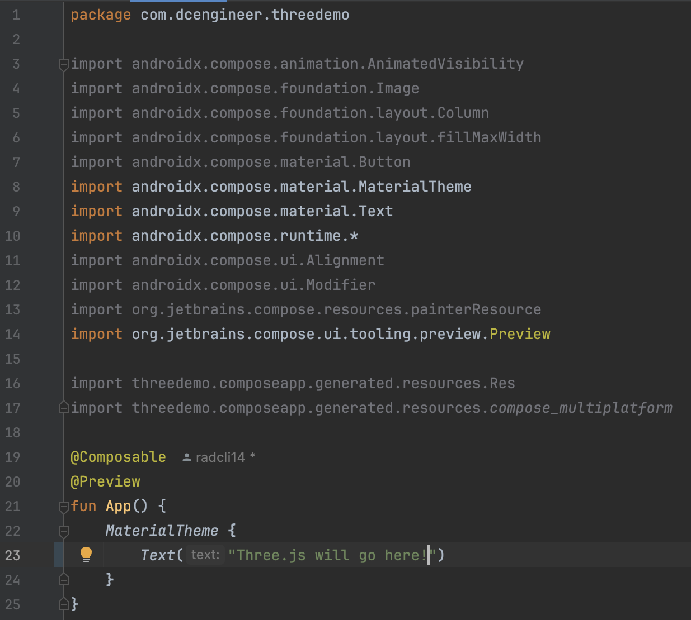
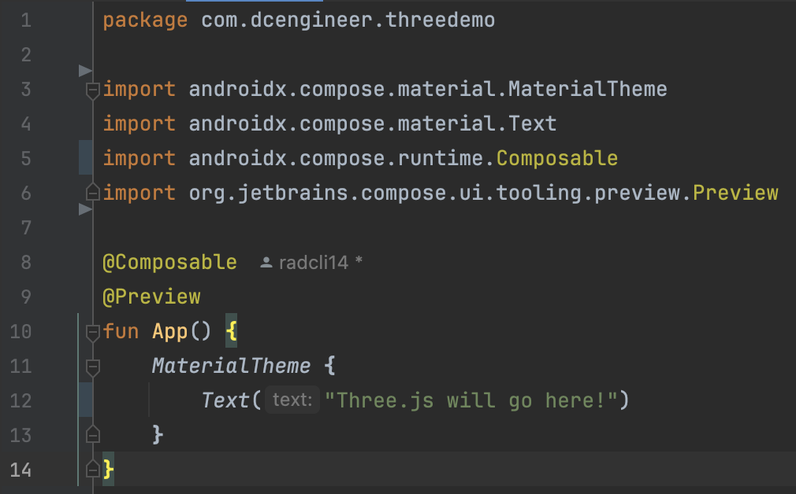

# ThreeJS-ComposeMultiplatform
Integration of the Three.js toolset into the Compose Multiplatform framework 

## Procedure

### Coding Environment Setup
- Install the latest Android Studio. [Link](https://developer.android.com/studio)
  * Optional: install XCode if building for iOS. 
- Configure Android Studio for Compose Multiplatform. [Link](https://www.jetbrains.com/help/kotlin-multiplatform-dev/compose-multiplatform-create-first-app.html)
  * Install the Kotlin Multiplatform plugin.
  * Run Kdoctor to verify.
- Optional: Create a GitHub project.
  * Give it a name.
  * Select public or private.
  * Optional: create README and license files.


 
### Compose Multiplatform Template
- Visit the Kotlin Multiplatform wizard site. [Link](https://kmp.jetbrains.com/?)
  * Provide a name, does not have to match your Github repository, I chose `ThreeDemo`.
  * Provide a unique project ID, I use `com.dcengineer.threedemo`.
    - These will generally use reverse domain syntax, and if you publish your app, will be used by the Google Play or App Store to identify it.
    - You should choose carefully as this may become semi-permanent.
  * Select which OS's you want to support.
    - For demonstration, I only selected Android and iOS.
    - For iOS, I selected to share UI, which is the purpose of Compose Multiplatform.
    - It is possible to migrate back to SwiftUI at a later date, Compose is likely a good choice for early prototyping.
    - Desktop, web, and server options are available, but will have varying degrees of support.
- Click the Download button
- Unzip, and move into your project folder.
- Optional, if you are using git, add, commit, and push your project to the remote.
```bash
git add ThreeDemo
git commit -am "added the compose multiplatform template files"
git push
```


### Open the Project in Android Studio
- Start Android Studio
- Click `File -> Open`
- Open the folder you just copied over.
   * In my case, I am selecting the `ThreeDemo` folder.
   * You do not need to select the root directory of the GitHub folder, just the folder created by the wizard.
- Usually, select to open the project in a new window
- "Trust" the project (its yours, after all)
- Android Studio will open starting from the `README.md` file
- After various gradle build and sync tasks complete, you may "Run" the project
   * You may need to set up an emulator, which is out of scope of this tutorial, but you may search online or use this [Link](https://developer.android.com/studio/run/emulator).
   * Or, you can run on your own device if you have one. [Link](https://developer.android.com/studio/run/device)
- The template app is just a simple button, which will display a Compose Multiplatform logo and platform-specific greeting when tapped.


### Optional: Remove Unnecessary Code and Resources

- In the upper left of the window, there is a dropdown; if it shows the word "Android," click on it and instead select "Project," which is my preferred view for multiplatform dependencies.
- Highlight the following files, and delete them (right click and refactor, press delete key, or other):
  * `composeApp/src/androidMain/kotlin/<yourAppID>/Platform.android.kt` : a script to get the string name of the Android platform, `Android 34` in the animation above.
  * `composeApp/src/commonMain/composeResources/drawable/compose-multiplatform.xml` : a Compose Multiplatform logo, the image in the center of the animation above.
  * `composeApp/src/commonMain/<yourAppID>/Greeting.kt` : a script that generates the greeting text, `Compose: Hello, Android 34` in the animation above.
  * `composeApp/src/commonMain/<yourAppID>/Platform.kt` : the "expect" function, that directs to the respective `Platform.android.kt` or `Platform.ios.kt` files depending on what device you are using.
  * `composeApp/src/iosMain/kotlin/<yourAppID>/Platform.ios.kt` : a script to get the string name of the iOS platform.
 - If you get a warning that the `Greeting.kt` file has one usage, delete it anyway, as we will remove that usage in the following step.
 - Navigate to `compose/src/commonMain/<yourAppID>/App.kt`; notice that the `Greeting().greet()` item is highlighted red, indicating that it will not build due to the deleted dependency.
 - Delete all of the code Between `MaterialTheme { ...` and its closing bracket, and replace with a single `Text("Three.js will go here!")`.
 - Hover above one of the now "grayed-out" import statements at the top of the window, and click "optimize imports" to remove those that are no longer required.
 - Run the app again, to get the now-simplified app.







### Add the Compose Multiplatform Webview Dependency
- As of February 2025, there is no official Web View built-in to the Compose Multiplatform framework, however, we can use a third-party widget created by Kevinn Zou [Link](https://kevinnzou.github.io/compose-webview-multiplatform/).
- We will add the dependency to our project using Gradle, specifically in the file `composeApp/build.gradle.kts` [Link](https://kevinnzou.github.io/compose-webview-multiplatform/installation/).
- Scroll down to the section `kotlin { ... sourceSets { ... commonMain.dependences { ...` and add `api("io.github.kevinnzou:compose-webview-multiplatform:1.9.40")`.
- Optionally, you may hover over the new dependency and click "replace with new library catalog dependency ...".
  * No effect on app itself, but a bit cleaner for dependency management.
  * Automatically changes to `api(libs.compose.webview.multiplatform)`
  * In `gradle/libs.versions.toml`, you will find the lines:
    - `composeWebviewMultiplatform = "1.9.40"`
    - `compose-webview-multiplatform = { module = "io.github.kevinnzou:compose-webview-multiplatform", version.ref = "composeWebviewMultiplatform" }`  
- Click "Sync Now" at the top of the screen to rebuild the gradle project.


