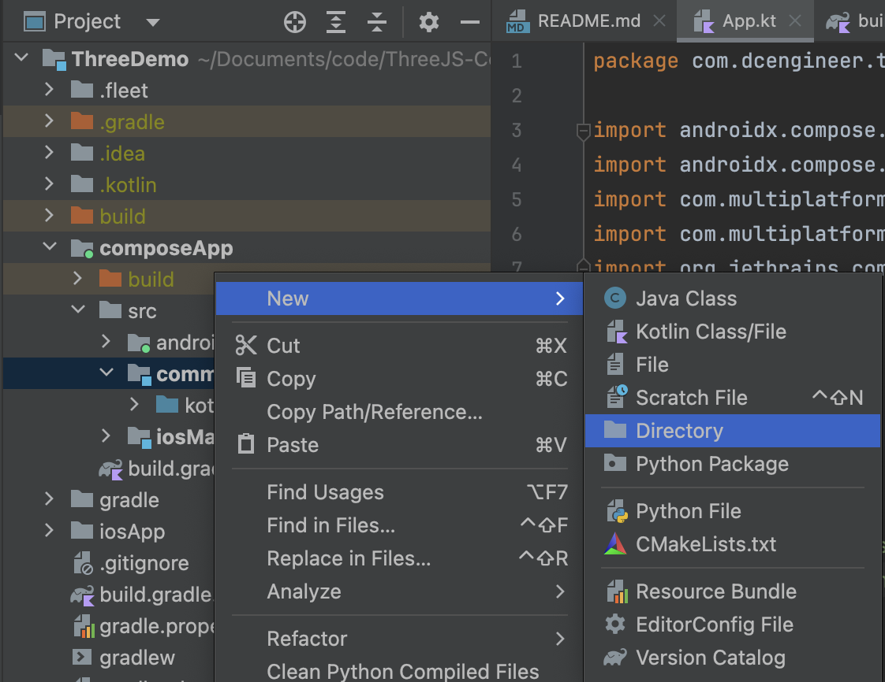

# ThreeJS-ComposeMultiplatform
Integration of the Three.js toolset into the Compose Multiplatform framework 

## Procedure

### Coding Environment Setup
- Install the latest Android Studio. [Link](https://developer.android.com/studio)
  * Optional: install XCode if building for iOS. 
- Configure Android Studio for Compose Multiplatform. [Link](https://www.jetbrains.com/help/kotlin-multiplatform-dev/compose-multiplatform-create-first-app.html)
  * Install the Kotlin Multiplatform plugin.
  * Run Kdoctor to verify.
- Optional: Create a GitHub project.
  * Give it a name.
  * Select public or private.
  * Optional: create README and license files.


 
### Compose Multiplatform Template
- Visit the Kotlin Multiplatform wizard site. [Link](https://kmp.jetbrains.com/?)
  * Provide a name, does not have to match your Github repository, I chose `ThreeDemo`.
  * Provide a unique project ID, I use `com.dcengineer.threedemo`.
    - These will generally use reverse domain syntax, and if you publish your app, will be used by the Google Play or App Store to identify it.
    - You should choose carefully as this may become semi-permanent.
  * Select which OS's you want to support.
    - For demonstration, I only selected Android and iOS.
    - For iOS, I selected to share UI, which is the purpose of Compose Multiplatform.
    - It is possible to migrate back to SwiftUI at a later date, Compose is likely a good choice for early prototyping.
    - Desktop, web, and server options are available, but will have varying degrees of support.
- Click the Download button
- Unzip, and move into your project folder.
- Optional, if you are using git, add, commit, and push your project to the remote.
```bash
git add ThreeDemo
git commit -am "added the compose multiplatform template files"
git push
```


### Open the Project in Android Studio
- Start Android Studio
- Click `File -> Open`
- Open the folder you just copied over.
   * In my case, I am selecting the `ThreeDemo` folder.
   * You do not need to select the root directory of the GitHub folder, just the folder created by the wizard.
- Usually, select to open the project in a new window
- "Trust" the project (its yours, after all)
- Android Studio will open starting from the `README.md` file
- After various gradle build and sync tasks complete, you may "Run" the project
   * You may need to set up an emulator, which is out of scope of this tutorial, but you may search online or use this [Link](https://developer.android.com/studio/run/emulator).
   * Or, you can run on your own device if you have one. [Link](https://developer.android.com/studio/run/device)
- The template app is just a simple button, which will display a Compose Multiplatform logo and platform-specific greeting when tapped.


### Optional: Remove Unnecessary Code and Resources

- In the upper left of the window, there is a dropdown; if it shows the word "Android," click on it and instead select "Project," which is my preferred view for multiplatform dependencies.
- Highlight the following files, and delete them (right click and refactor, press delete key, or other):
  * `composeApp/src/androidMain/kotlin/<yourAppID>/Platform.android.kt` : a script to get the string name of the Android platform, `Android 34` in the animation above.
  * `composeApp/src/commonMain/composeResources/drawable/compose-multiplatform.xml` : a Compose Multiplatform logo, the image in the center of the animation above.
  * `composeApp/src/commonMain/<yourAppID>/Greeting.kt` : a script that generates the greeting text, `Compose: Hello, Android 34` in the animation above.
  * `composeApp/src/commonMain/<yourAppID>/Platform.kt` : the "expect" function, that directs to the respective `Platform.android.kt` or `Platform.ios.kt` files depending on what device you are using.
  * `composeApp/src/iosMain/kotlin/<yourAppID>/Platform.ios.kt` : a script to get the string name of the iOS platform.
 - If you get a warning that the `Greeting.kt` file has one usage, delete it anyway, as we will remove that usage in the following step.
 - Navigate to `compose/src/commonMain/<yourAppID>/App.kt`; notice that the `Greeting().greet()` item is highlighted red, indicating that it will not build due to the deleted dependency.
 - Delete all of the code Between `MaterialTheme { ...` and its closing bracket, and replace with a single `Text("Three.js will go here!")`.
 - Hover above one of the now "grayed-out" import statements at the top of the window, and click "optimize imports" to remove those that are no longer required.
 - After optimizing imports, the entire `App.kt` file should be as follows:

```kotlin
package <yourAppID>

import androidx.compose.material.MaterialTheme
import androidx.compose.material.Text
import androidx.compose.runtime.Composable
import org.jetbrains.compose.ui.tooling.preview.Preview

@Composable
@Preview
fun App() {
    MaterialTheme {
        Text("Three.js will go here!")
    }
}
```

 - Run the app again, to get the now-simplified app.


### Add the Compose Multiplatform Webview Dependency
- As of February 2025, there is no official Web View built-in to the Compose Multiplatform framework, however, we can use a third-party widget created by Kevinn Zou [Link](https://kevinnzou.github.io/compose-webview-multiplatform/).
- We will add the dependency to our project using Gradle, specifically in the file `composeApp/build.gradle.kts` [Link](https://kevinnzou.github.io/compose-webview-multiplatform/installation/).
- Scroll down to the section `kotlin { ... sourceSets { ... commonMain.dependences { ...` and add `api("io.github.kevinnzou:compose-webview-multiplatform:1.9.40")`.
- Optionally, you may hover over the new dependency and click "replace with new library catalog dependency ...".
  * No effect on app itself, but a bit cleaner for dependency management.
  * Automatically changes to `api(libs.compose.webview.multiplatform)`
  * In `gradle/libs.versions.toml`, you will find the lines:
    - `composeWebviewMultiplatform = "1.9.40"`
    - `compose-webview-multiplatform = { module = "io.github.kevinnzou:compose-webview-multiplatform", version.ref = "composeWebviewMultiplatform" }`  
- Click "Sync Now" at the top of the screen to rebuild the gradle project.
- Create a basic HTML string to test the WebView in the space directly above the `MaterialTheme { ...` line:
```kotlin
val html = """
<html>
    <body>
        <h1>Three.js will go here!</h1>
        <p>Soon with JavaScript...</p>
    </body>
</html>
""".trimIndent()
```
- Immediately below, create the state that holds the HTML string:
```kotlin
val webViewState = rememberWebViewStateWithHTMLData(
    data = html
)
```
- Replace the `Text("Three.js will go here!")` line from earlier with `WebView(webViewState)`, and remove the `Text` import.
- Run the app to verify that the HTML is loaded and formatted in the WebView.


### Create HTML Header and `Three.js` Javascript Resources
- If it does not exist already, create a `composeApp/commonMain/composeResources/files` directory.
  * When we deleted the Compose Multiplatform logo earlier, it was in `composeResources/drawable`.
  * Because there would be no other shared resources, Android Studio may automatically remove the `composeResources` folder, however, we can add it back in.
  * Right click on `commonMain` in the Projects navigator, hover over "New" and then "Directory," and enter `composeResources` in the dialog that appears.
  * Repeat this process, right clicking on the newly created `composeResources` and creating a `files` subdirectory.
- Add empty files named `index.html` and `cube.js` inside.
  * Right click on the newly created `files` directory, then hover over "New" and then "File," and enter `index.html` in the dialog that appears.
  * Repeat, this time creating an empty `cube.js` file.
- Inside the newly created `index.html`, paste the following:
```html
<!DOCTYPE html>
<html lang="en">
<head>
    <meta charset="UTF-8">
    <meta name="viewport" content="width=device-width, initial-scale=1.0">
    <title>Three.js Demo</title>
    <script src="https://cdn.jsdelivr.net/npm/three@0.173.0/build/three.min.js"></script>
    <style>
        * {
            margin: 0;
            padding: 0;
            box-sizing: border-box;
        }
        html, body {
            width: 100%;
            height: 100%;
            overflow: hidden;
        }
        canvas {
            display: block;
        }
    </style>
</head>
<body>
<script>
/*CODE*/
</script>
</body>
</html>
```
- Inside the newly created `cube.js`, paste the following
```js
const scene = new THREE.Scene();
const camera = new THREE.PerspectiveCamera(75, window.innerWidth / window.innerHeight, 0.1, 1000);
const renderer = new THREE.WebGLRenderer();
renderer.setSize(window.innerWidth, window.innerHeight);
document.body.appendChild(renderer.domElement);

const geometry = new THREE.BoxGeometry();
const material = new THREE.MeshNormalMaterial();
const cube = new THREE.Mesh(geometry, material);
scene.add(cube);

camera.position.z = 5;

function animate() {
    requestAnimationFrame(animate);
    cube.rotation.x += 0.01;
    cube.rotation.y += 0.01;
    renderer.render(scene, camera);
}

animate();
```




### Add Internet Permission (Android-only)
- Add internet permission to the `composeApp/src/androidMain/AndroidManifest.xml`
  * **Important**: `three.min.js` needs to be downloaded from a remote server, if you don't complete this step you may see a blank screen


### Update the WebView to Reference the Resources

- First, try replacing the existing HTML string with a version that will read from the shared resource file. [Link (note that because we used the wizard earlier, the dependencies were already added)](https://www.jetbrains.com/help/kotlin-multiplatform-dev/compose-multiplatform-resources-usage.html#raw-files)
```kotlin
val html = Res.readBytes("files/index.html").decodeToString()
```
- The `.readBytes` method will have a red underline, indicating errors we must correct prior to compilation:
  * "Suspend function 'readBytes' should be called only from a coroutine or another suspend function"
  * "This API is experimental and likely to change in the future"
- The latter is a simple fix, click the "opt-in" link at the bottom, which will insert `@OptIn(ExperimentalResourceApi::class)` above your `App` definition
- The former may be corrected by reading the file within a `LaunchedEffect`; since we also will want to load the text of the `cube.js` file, we do this with both:
```kotlin
var html by remember { mutableStateOf("") }
var js by remember { mutableStateOf("") }
LaunchedEffect(Unit) {
    html = Res.readBytes("files/index.html").decodeToString()
    js = Res.readBytes("files/cube.js").decodeToString()
}
```
- We have designated the HTML and JavaScript strings as `remember` variables so that their state is retained across re-compositions, and to assure that the UI updates once their text has been loaded.
- Move the content associated with the `WebView` into its own `@Composable` function which takes the `html` string:
```kotlin
@Composable
fun ThreeJsWebView(html: String) {
    val webViewState = rememberWebViewStateWithHTMLData(
        data = html
    )
    WebView(webViewState, modifier = Modifier.fillMaxSize())
}
```
- Call this new `ThreeJsWebView(html)` function in place of the prior `WebView(webViewState)`, and insert the JavaScript in place of the placeholder `/*CODE*/`:
```kotlin
MaterialTheme {
    ThreeJsWebView(html.replace("/*CODE*/", js))
}
```
- If you build and run the app now, you should see a rotating cube; congratulations, you have embedded Three.js in a Compose Multiplatform app!


